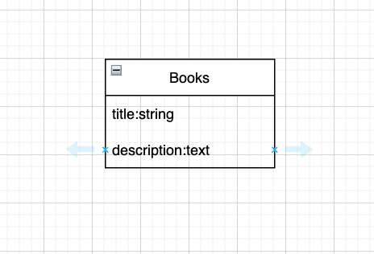

# Class 8 **Ruby on Rails - Project Exercises** 

## *Description*
The next couple of weeks will be project based exercises.

Topics Covered:
- MVC 
- Controllers 
- Models
- Views
- Database
- Routes

Complete the following requirements:

 

---
 

- What is your project about? Here are some helpful links to help you decided what to develop:
  - [Link 1](https://github.com/florinpop17/app-ideas)
  - [Link 2](https://github.com/The-Cool-Coders/Project-Ideas-And-Resources)
  - [Link 3](https://sloboda-studio.com/blog/fun-and-weird-ruby-on-rails-projects/)
- Generate a Rail's application 
- GitHub
  - Publish to GitHub publicly 
  - Create a separate branch to work on 
- Use [app.diagrams.net](https://app.diagrams.net/) to create an [ER diagram](https://www.lucidchart.com/pages/er-diagrams). 
  - Create at least one `"entity"` that is a representation of a table in your schema file. Here is an example. 

- Generate a `migration` file. In the migration file include the following:
  - Create a table 
  - Include at least two `attributes` (columns)
- Create at least one `model` class 
  - Include at least one `validation`
- Create at least one `controller` class 
  - Define at least two `actions`
- Create at least two `ERB` files. 
- Create at least two `routes`. Each route should present to the user a view.
- Define the `root` route
- Deploy to `Heroku`
- `Push` to `GitHub` to current branch or make a pull request to the main branch (merge to main on GitHub).

 

---

 

**Further Exploration**
- byebug gem 

**Resources** 
- [Rails 6.1 docs](https://guides.rubyonrails.org/v6.1/)
- [Class Notes](https://github.com/cruzgerman216/CodeLabs-Ruby-on-Rails-Class-Notes/blob/main/C08-CRUD-Operations-Part-1/BookIt_app_part_1.md)

 

---

 

:wave: Saw a misspelled word? Want to improve the class exercises? Create a **pull request** and **contribute**!
