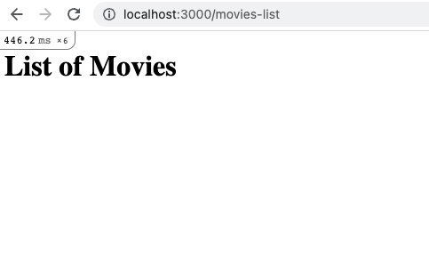
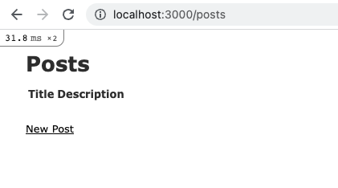
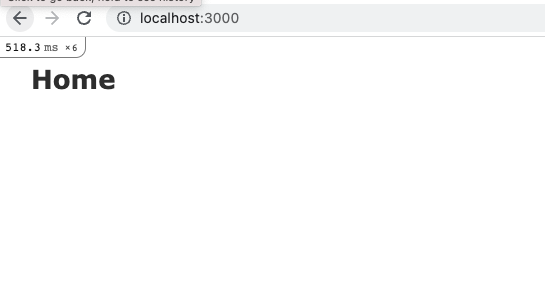

# Ruby on Rails Exercises

**<em>Exercise 1</em>: Creating a basic Rails app**

- Generate a rails application called `my-first-rails-app`
- Launch a web server that bundles the Rails application
- Manually create a `pages` controller file
- Define a `PagesController` class and an instance method called `profile`.
- Create a profile.html.erb under `pages` in `views`.
- Create an `h1` with content "My profile Page"
- Create a path that routes to 'myprofile' in the URL and setup the corresponding controller and method.

- push to GitHub

**<em>Exercise 2</em>: Creating an erb file**
- Generate a rails application called `rails-exercise-2-app`
- Manually create a `movies` controller file
- Define an instance method called `movies_list`
- Create an erb file called `movies`. In the file, create an `h1` element with content `List of Movies`
- In the `movies_list` method, render the `movies.html.erb` file. ([this](https://guides.rubyonrails.org/v4.1/layouts_and_rendering.html) may help you )
- Create a path that routes to `/movies-list` and set up the corresponding controller and method.
- run `rails s`, you should be able to see `List of Movies` in 'localhost:3000/movies-list'

- push to GitHub

**<em>Exercise 3</em>: Scaffold application**

- Generate a Rails application called `rails-basic-scaffold-app`
- Use the scaffold command to generate `Post` which includes fields `title` which is of type `string` and `description` which is of type `text`.
- Because you generated a model, create a schema by migrating the files using `rails db:migrate`
- run `rails s` and go through the application

- push to GitHub

**<em>Exercise 4</em>: More rails**

- Generate a Rails application called `rails-exercise-4-app`
- Manually create or generate a controller called `pages`
- Define methods `home` and `about`
- In the `route.rb` file, create a `root` path that is set to the `home` method in the pages controller
- Create another route that is set to the `about` method in the pages controller
- Create an ERB for each home and about method with a couple of HTML elements
- Render both erb files to the corresponding methods that exist in the pages controller

